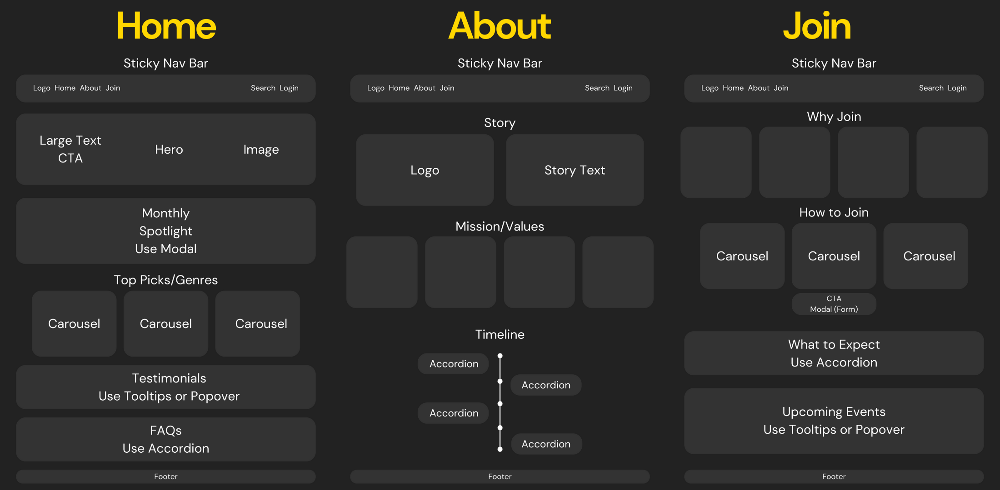

# BookNest📙 | Bootstrap Capstone
### Ivan Reyes | ACS 1920 | Adam Braus

---

### Wireframe

---

### ℹ️ Program Description
**BookNest** is an online book club platform designed to connect readers worldwide. Share your passion for reading, discover new books, engage in discussions, and attend virtual events – all in one online nest.

**Key features:**
*   **Bootstrap Feature:** Built with Bootstrap components, with additional custom CSS.
*   **Interactive Elements:** Dynamic components like carousels, modals, tooltips, and accordions for an engaging user experience.
*   **User-Friendly Navigation:** A clear and intuitive navbar.
*   **Visually Appealing:** A clean and modern design with a dark theme.
*   **Three Pages:**
    *   **Home:** Discover the book of the month, top genres, member testimonials, and FAQs.
    *   **About Us:** Learn about BookNest's story, and values, and their progression throughout the years.
    *   **Join the Nest:**  Find out why you should join and how to become a member.

---

### 🔐 Key Bootstrap Components Implemented
*   **Navbar:**  Sticky top navbar for easy navigation.
*   **Grid System:**  Used to create responsive layouts.
*   **Cards:**  Display information about books, genres, and testimonials.
*   **Carousels:** Showcase top picks in different genres.
*   **Modals:** Provide detailed information about the book of the month and a form for creating an account.
*   **Accordions:** Organize FAQs and information about how BookNest works.
*   **Tooltips:** Offer additional context on testimonials and events.

---

### 💻 Technologies Used
*   **HTML5**
*   **CSS**
*   **Bootstrap 5**
*   **Bootswatch (Darkly theme)**
*   **JavaScript**

---

### 📁 Project Structure 
*   `index.html`: Home Page
*   `about.html`: About Us Page
*   `join.html`: Join the Nest Page
*   `styles.css`: Custom CSS File
*   `images/`: Folder containing images used throughout the website
